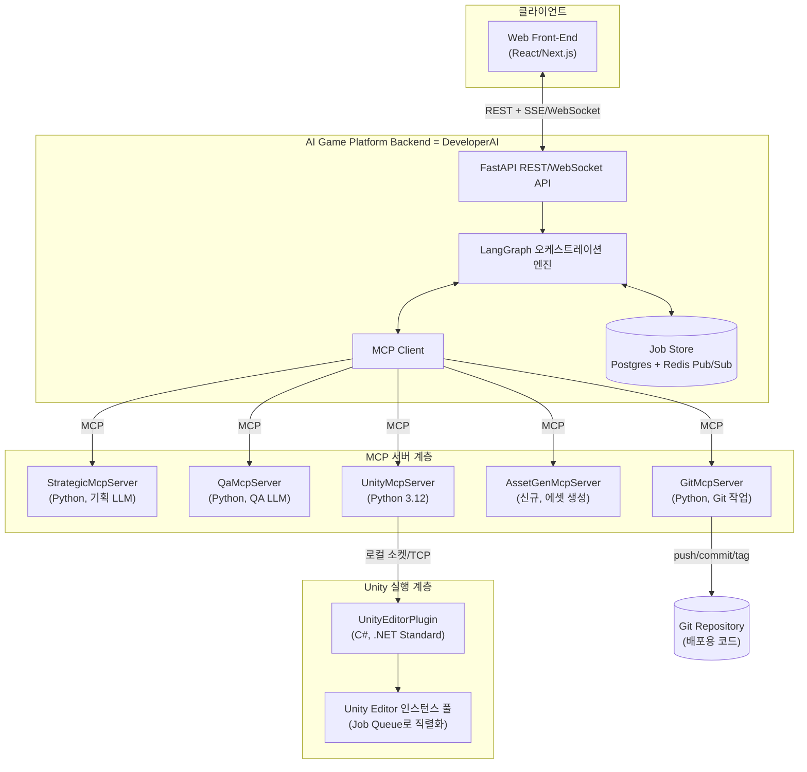
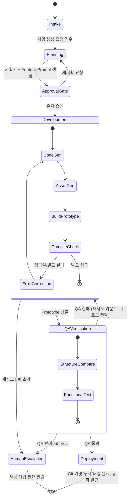
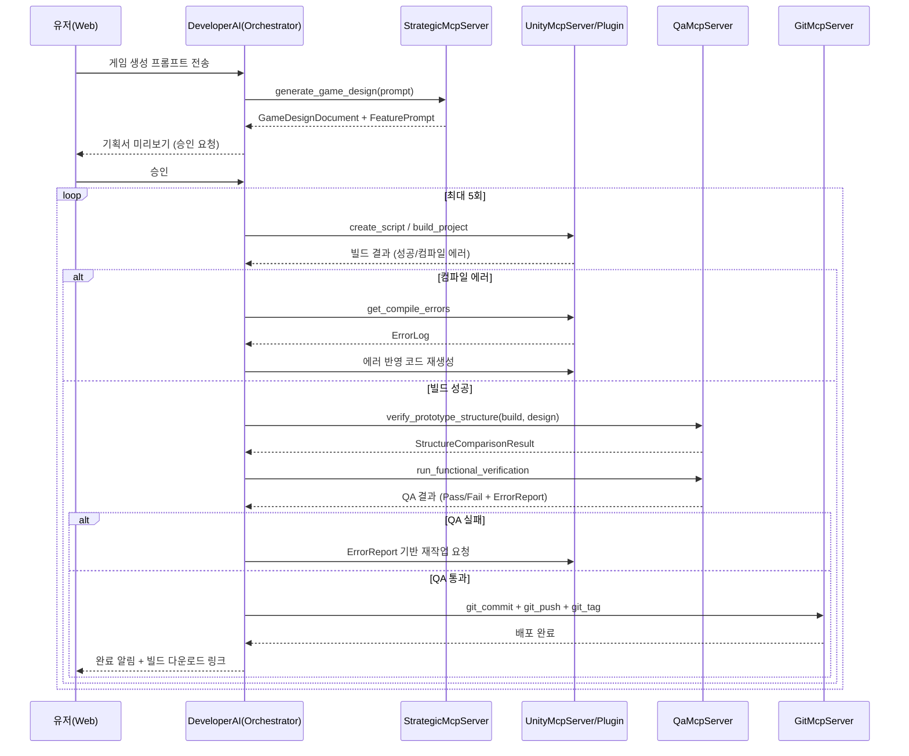

# 최종 시스템 설계 명세서
## AI 자동 게임 생성 플랫폼 (Web → Strategic AI → Developer AI → QA AI → Git 배포)

**버전**: v0.1 (개발 착수용)
**작성일**: 2026-07-15

이 문서는 `01_아키텍처_검토서.md`의 보완사항을 반영한 최종 설계입니다. 개발 착수 시 본 문서를 기준으로 각 컴포넌트 레포지토리를 생성하면 됩니다.

---

## 1. 전체 시스템 구성도



**핵심 정정 사항**: `AI Game Platform Backend` = `DeveloperAI`(오케스트레이터) 그 자체이며, Strategic/QA/Unity/Asset/Git은 모두 이 오케스트레이터 아래의 **동급 MCP 서버**입니다. 기존 구성도의 "Developer AI (Unity Assistant)"가 형제 노드로 그려진 부분은 오류이므로 이 구조로 대체합니다.

---

## 2. 컴포넌트별 상세 모듈 설계

### 2.1 DeveloperAI (Orchestrator) — 신규 정의
| 항목 | 내용 |
|---|---|
| 언어/스택 | Python 3.12, FastAPI, LangGraph, MCP Client |
| 책임 | 유저 요청 접수 → 전체 파이프라인 상태 관리 → 각 MCP 서버 호출 오케스트레이션 → 프론트엔드로 진행상황 스트리밍 |
| 주요 API | `POST /games` (게임 생성 요청) / `GET /games/{id}/status` / `GET /games/{id}/stream` (SSE) / `POST /games/{id}/approve` (기획 승인 게이트) |
| 상태 저장 | Postgres = **Neon** (Job 영속화, 5432 기본 + 443/HTTPS 폴백 → §7.6, `05_NeonDB_Access_Specification.md`), Redis (실시간 pub/sub) |
| 비고 | 실제 코드 생성은 하지 않음. UnityMcpServer/AssetGenMcpServer에 위임하는 "지휘자" 역할만 수행 |

### 2.2 StrategicMcpServer
| 항목 | 내용 |
|---|---|
| 언어/스택 | Python, MCP Server |
| 모델 특성 | High-Performance / 고차 추론형 모델 권장 |
| 제공 Tool | `analyze_genre`, `generate_game_design`, `generate_feature_prompt` |
| 입력 | 유저 원본 프롬프트 |
| 출력 | `GameDesignDocument` (§5.1), `FeatureImplementationPrompt[]` (§5.2) |

### 2.3 QaMcpServer
| 항목 | 내용 |
|---|---|
| 언어/스택 | Python, MCP Server |
| 모델 특성 | Creative / 구조 비교·추론에 강한 모델 |
| 제공 Tool | `verify_prototype_structure`, `compare_structure`, `establish_qa_policy`, `run_functional_verification`, `generate_error_report` |
| 입력 | `GameDesignDocument`, 빌드된 Prototype 메타데이터, 실행 로그 |
| 출력 | `QAPolicy` (§5.3), `ExecutionErrorReport` (§5.4) — 실패 시 Developer AI로 회신 |

### 2.4 UnityMcpServer + UnityEditorPlugin
| 항목 | 내용 |
|---|---|
| 언어/스택 | UnityMcpServer: Python 3.12 / UnityEditorPlugin: C# (.NET Standard, Unity) |
| 통신 | UnityMcpServer ↔ UnityEditorPlugin: 로컬 TCP 소켓 (예: `localhost:6400`) |
| 제공 Tool | 설계: `design_architecture` / 생성: `create_script` / 조립: `create_prefab`, `compose_scene`, `bind_reference`, `create_scene`, `import_asset` / 빌드·검사: `build_project`, `run_playmode_test`, `get_compile_errors`, `inspect_project_layout` (권위 있는 목록은 §03, 배경은 §06) |
| 동시성 정책 | Job Queue로 직렬화 (§7.1), Editor 인스턴스는 Job 1개당 1개 점유 |
| 보안 정책 | 생성된 C# 스크립트는 실행/컴파일 전에 금지 API(예: `System.Diagnostics.Process`, 파일시스템 전체 접근 등) 화이트리스트 검사 통과 필요 |

### 2.5 AssetGenMcpServer (신규 제안)
| 항목 | 내용 |
|---|---|
| 목적 | "2D/3D art 및 UI 에셋 생성" 단계의 실행 주체를 명확히 함 |
| 언어/스택 | Python, MCP Server |
| 제공 Tool | `generate_2d_sprite`, `generate_ui_asset`, `generate_3d_placeholder` |
| 구현 옵션 | 외부 이미지 생성 API 연동, 또는 초기 MVP에서는 스톡 에셋/프로시저럴 도형으로 대체 후 고도화 |

### 2.6 GitMcpServer
| 항목 | 내용 |
|---|---|
| 언어/스택 | Python, MCP Server |
| 제공 Tool | `git_init`, `git_commit`, `git_push`, `git_tag`, `git_branch`, `git_status` |
| 저장소 전략 | 게임 1개 = 저장소 1개. 이름 규칙 `{genre}-{prompt-slug}-{gameId}`. `git_init`은 멱등이라 신규 게임은 새 저장소를, 기존에 배포 이력이 있는 게임은 기존 저장소를 그대로 재사용한다. 저장소 내부는 `main` 브랜치 하나만 사용 |
| 커밋 메시지 | 오케스트레이터가 자동 생성 (예: `[AutoGen] {game_title} - QA Pass v{n}`) |
| 자격증명 | 별도 Secret Manager(예: Vault/AWS Secrets Manager)에서 주입, 코드/로그에 노출 금지 |

---

## 3. LangGraph 오케스트레이션 상태 흐름도



**루프 종료 조건 (검토서 §3.3 반영)**: Development ↔ QA 루프는 최대 5회로 제한. 초과 시 자동 실패 처리하지 않고 `HumanEscalation` 상태로 전환하여 담당자에게 알림 (Slack/Email 등, 별도 연동 필요).

---

## 4. 전체 파이프라인 시퀀스 다이어그램



---

## 5. 데이터 계약 (Agent 간 JSON Schema)

### 5.1 GameDesignDocument (Strategic AI → Orchestrator/QA)
```json
{
  "game_id": "string(uuid)",
  "genre": "string",
  "core_mechanics": ["string"],
  "art_style": "string",
  "target_platform": "PC | Mobile | WebGL",
  "structure_overview": "string",
  "created_at": "ISO8601"
}
```

### 5.2 FeatureImplementationPrompt (Strategic AI → Developer AI)
```json
{
  "feature_id": "string",
  "title": "string",
  "description": "string",
  "priority": "P0 | P1 | P2",
  "dependencies": ["feature_id"],
  "assets_needed": ["string"]
}
```

> `assets_needed` 는 추가 필드다 (기본값 `[]`, 2026-07-29). spec 의
> `unityHints.assetsNeeded` 를 그대로 실어 AssetGen 이 자산을 하나씩
> 요청하게 한다 — 근거와 분기 규칙은
> [05_계약_변경_제안서](05_계약_변경_제안서.md) §4.4.

### 5.3 QAPolicy (QA AI)
```json
{
  "test_cases": [
    { "case_id": "string", "description": "string", "expected_result": "string" }
  ],
  "acceptance_criteria": ["string"]
}
```

### 5.4 ExecutionErrorReport (QA AI → Developer AI)
```json
{
  "error_type": "compile | runtime | logic | structure_mismatch",
  "message": "string",
  "file": "string",
  "line": "number|null",
  "suggested_fix": "string",
  "related_feature_id": "string"
}
```

### 5.5 JobState (Orchestrator 내부)
```json
{
  "game_id": "string(uuid)",
  "status": "planning | awaiting_approval | developing | qa_review | deploying | done | escalated",
  "iteration_count": "number",
  "current_stage": "string",
  "history": ["object"]
}
```

---

## 6. Web ↔ Backend API 정의

| Method | Endpoint | 설명 |
|---|---|---|
| POST | `/games` | 게임 생성 요청 (프롬프트 입력) → `game_id` 반환 |
| GET | `/games/{id}/status` | 현재 상태 폴링용 |
| GET | `/games/{id}/stream` | SSE/WebSocket 실시간 진행 스트리밍 |
| POST | `/games/{id}/approve` | 기획서 승인/재요청 |
| GET | `/games/{id}/artifact` | 최종 빌드/Git 링크 조회 |
| POST | `/games/{id}/cancel` | 진행 중 작업 취소 |

---

## 7. 비기능 요구사항 및 운영 전략

### 7.1 동시성 (검토서 §3.4 대응)
- MVP 단계: Job Queue(Redis 기반) + 단일 Unity Editor 인스턴스로 순차 처리
- 확장 단계: Docker 기반 Unity Editor 인스턴스 풀 또는 `-batchmode -nographics` 헤드리스 빌드로 전환

### 7.2 재시도/타임아웃
- MCP tool 호출: 3회 재시도, exponential backoff
- LLM 응답: 타임아웃 60~120초, 초과 시 실패 처리 후 재시도 큐 등록
- Development↔QA 루프: 최대 5회, 초과 시 `HumanEscalation`

### 7.3 보안
- Git 자격증명은 Secret Manager에서 런타임 주입, 코드/로그 노출 금지
- LLM 생성 C# 코드는 실행 전 금지 API 화이트리스트 정적 검사
- MCP 서버 간 통신은 내부망(private network)으로 제한, 외부 노출은 Web↔Orchestrator API만

### 7.4 관측성(Observability)
- 각 MCP tool 호출/응답을 Job 단위로 로깅 (structured logging)
- LangGraph 각 노드 전이 이벤트를 Job history에 축적하여 디버깅/재현 가능하게 함

### 7.5 모델 선택 전략
| Agent | 특성 | 권장 모델 유형 |
|---|---|---|
| StrategicMcpServer | 고차 추론/기획 | 고성능 추론형 모델 |
| UnityMcpServer(코드생성 LLM) | 코드 특화 | 코드 생성 특화 모델 |
| QaMcpServer | 구조 비교/크리에이티브 검증 | 균형형 모델 |

### 7.6 DB 접속 경로 (Neon, 5432 차단망 대응)
- Job Store는 Neon(서버리스 Postgres)을 사용한다. 기본 경로는 **5432 TCP + TLS**.
- 사내/교육망에서 5432 아웃바운드가 차단되면 연결 타임아웃으로 파이프라인이 `Intake`에서 정지한다. 2026-07-27 실측 결과 현재 개발망은 **5432 차단 / 443 정상**이다.
- 따라서 오케스트레이터 Repository 계층은 **443 HTTPS(SQL over HTTP) 폴백 경로**를 필수로 갖춘다. 기동 시 preflight로 경로를 결정하고, 운영 중 연결 실패가 누적되면 자동 강등·쿨다운 후 승격한다.
- **DB에 접근하는 주체는 오케스트레이터 하나뿐이다.** MCP 서버 5종(Strategic/QA/Unity/Asset/Git)은 상태를 갖지 않으므로 DB 자격증명을 부여하지 않는다.
- 상세 프로토콜·제약·참조 구현: `05_NeonDB_Access_Specification.md`

---

## 8. 개발 로드맵 제안

| Phase | 목표 | 산출물 |
|---|---|---|
| Phase 1 | Orchestrator 뼈대 + StrategicMcpServer 연동 | 프롬프트 입력 → 기획서 산출까지 E2E |
| Phase 2 | UnityMcpServer + UnityEditorPlugin 연동 | 기획서 → 최소 Prototype 빌드 성공 |
| Phase 3 | QaMcpServer 연동 + 피드백 루프 | QA 통과/반려 루프 동작 |
| Phase 4 | GitMcpServer 연동 + 배포 자동화 | QA 통과 시 자동 커밋/푸시/태깅 |
| Phase 5 | 동시성/보안/모니터링 강화 | Job Queue 고도화, 샌드박싱, 로깅 체계 |

---

이 문서와 `01_아키텍처_검토서.md`를 기준으로 각 컴포넌트(DeveloperAI, StrategicMcpServer, QaMcpServer, UnityMcpServer, UnityEditorPlugin, GitMcpServer, AssetGenMcpServer) 레포지토리를 생성하면 바로 개발 착수가 가능합니다.
