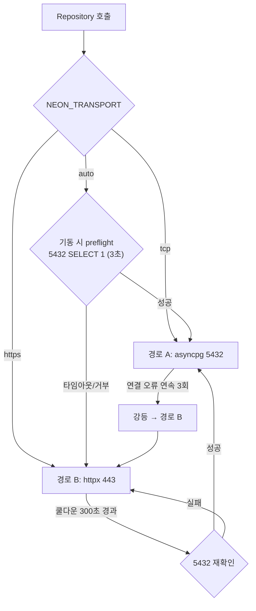

# NeonDB 접속 명세서 — 5432 기본 경로 + 443/HTTPS 폴백

**버전**: v0.1
**작성일**: 2026-07-27
**연관 문서**: `02_시스템_설계명세서.md` (§2.1 상태 저장, §7.2 재시도/타임아웃, §7.3 보안), `01_DeveloperAI_Design.md` (§4 Repository), `CLAUDE.md` (SQL은 Repository에만)

> ⚠️ **구현 상태 경고 (2026-08-02 확인).** 이 문서의 §5 폴백 전환 정책과 §7 참조
> 구현(`transport/{base,tcp,https,failover}.py`)은 **오케스트레이터에 아직 구현되지
> 않았다.** 실제 `Src/DeveloperAI/app/repository/database.py` 는 SQLAlchemy
> `create_async_engine` 으로 5432 만 쓰며 443 폴백 경로가 없다. 443 폴백이 실재하는
> 곳은 `Src/McpServers/strategic/neon_http.py` 하나뿐인데, 이 문서 §2.1 은 MCP 서버가
> DB 를 만지지 않는다고 정하고 있어 **명세와 코드가 서로 어긋나 있다.**
> 이 간극을 어느 쪽으로 맞출지는 사람이 정해야 한다 (백로그 항목 참고).

이 문서는 설계상 "Postgres (Job 영속화)"로만 적혀 있던 저장소를 **Neon(서버리스 Postgres)** 으로 구현할 때의 접속 경로를 확정한다. 핵심은 두 가지다.

1. **누가 NeonDB에 접근하는가**를 확정한다 (§2).
2. 5432가 막힌 망에서도 파이프라인이 완주하도록 **443/HTTPS 폴백 경로**를 정의한다 (§3~§7).

---

## 1. 배경 — 폴백이 필요한 이유 (실측)

Neon의 기본 접속은 Postgres 와이어 프로토콜 = **TCP 5432 + TLS**다. 다수의 사내망/교육망은 5432 아웃바운드를 차단하며, 이 경우 증상은 "인증 실패"가 아니라 **연결 타임아웃**이다. 오케스트레이터는 Job을 영속화하지 못하므로 `Intake` 단계에서 전체 파이프라인이 멈춘다.

2026-07-27, 현재 개발 PC 네트워크에서 동일 Neon 호스트를 대상으로 실측한 결과:

| 경로 | 결과 |
|---|---|
| `ep-…-pooler.<region>.aws.neon.tech:5432` (TCP) | **차단** — 15초 내 `TimeoutError`, 응답 없음 |
| `https://ep-…-pooler.<region>.aws.neon.tech/sql` (443) | **정상** — `HTTP 200`, 질의·파라미터·배치·오류 응답 모두 동작 확인 |

따라서 443 폴백은 "있으면 좋은 것"이 아니라 **현재 개발 환경에서 유일하게 동작하는 경로**다. 동일 패턴이 자매 레포 `Game-Design-and-Planning_resarch`(`bridge/neon_bridge.mjs`, `db/neon_https.py`)에서 이미 검증되어 운영 중이며, 본 명세는 그 경험을 비동기 백엔드용으로 재작성한 것이다.

---

## 2. NeonDB 접근이 필요한 컴포넌트 (확인 결과)

| 컴포넌트 | MCP 서버 여부 | NeonDB 접근 | 근거 | 사용 경로 |
|---|---|---|---|---|
| **DeveloperAI (Orchestrator)** | ✕ (MCP **클라이언트**) | **필수 (R/W)** | 02 §2.1 "상태 저장: Postgres", §5.5 `JobState`, 01 §4 "Repository — PostgreSQL 접근" | 이중 경로 (§3) |
| StrategicMcpServer | ○ | 불필요 (조건부 R) | 02 §2.2 — 입력=유저 프롬프트, 출력=문서. 상태 없음 | — |
| QaMcpServer | ○ | 불필요 (조건부 R/W) | 02 §2.3 — 결과를 오케스트레이터로 회신할 뿐 저장 주체가 아님 | — |
| UnityMcpServer (+Plugin) | ○ | **불필요** | 02 §2.4 — 로컬 TCP 소켓 + 파일시스템만 사용 | — |
| AssetGenMcpServer | ○ | 불필요 (조건부 R/W) | 02 §2.5 — 외부 이미지 API 호출, 산출물은 파일 | — |
| GitMcpServer | ○ | **불필요** | 02 §2.6 — Git 조작 + Secret Manager | — |

### 2.1 결론

**현재 명세 기준으로 NeonDB에 직접 접근해야 하는 MCP 서버는 없다.** DB를 만지는 유일한 주체는 오케스트레이터(DeveloperAI)의 Repository 계층이다.

이는 우연이 아니라 의도된 설계이며, 유지해야 한다.

- MCP 서버는 **상태 없는 도구(stateless tool)** 로 정의되어 있다 (02 §2.2~§2.6: 모두 입력→출력 계약만 가진다).
- 상태의 단일 소유자를 오케스트레이터로 고정하면 이중 쓰기·정합성 붕괴·Job 이력 분산을 원천 차단할 수 있다 (02 §7.4 관측성 요구와도 정합).
- 결과적으로 **폴백 경로 구현이 필요한 곳도 오케스트레이터 한 곳뿐**이다. MCP 서버 5종은 손댈 필요가 없다.

### 2.2 조건부 후보 — 지금 결정할 필요는 없지만 기록해 둔다

아래 3개는 "요구가 추가되면" DB가 필요해지는 후보다. 현재 명세에는 그런 요구가 없으므로 접근을 부여하지 않는다.

| 후보 | 필요해지는 조건 | 권고 |
|---|---|---|
| StrategicMcpServer | 자매 레포의 리서치 카드 미러(`cards` 테이블)를 장르/요소 레퍼런스로 **직접 조회**하기로 결정할 때 | 별도 **읽기 전용 롤**로 분리 접속. Job 테이블 접근 금지 |
| QaMcpServer | QA 이력을 서버가 직접 축적해 회귀 비교(이전 빌드 대비)를 수행할 때 | 오케스트레이터가 이력을 넘겨주는 방식 우선 검토. DB 직결은 최후 수단 |
| AssetGenMcpServer | 생성 에셋 캐시/중복 방지 인덱스를 서버가 소유할 때 | 파일 해시 기반 로컬 캐시로 먼저 해결 시도 |

세 경우 모두 부여 시점에 **§3의 이중 경로 트랜스포트를 그대로 재사용**한다(공용 모듈로 배포). 각자 psycopg/asyncpg를 새로 붙이지 않는다.

---

## 3. 접속 경로 설계

| | 경로 A (기본) | 경로 B (폴백) |
|---|---|---|
| 포트/프로토콜 | 5432 / Postgres 와이어 + TLS | 443 / HTTPS (SQL over HTTP) |
| 드라이버 | `asyncpg` (커넥션 풀) | `httpx.AsyncClient` (순수 Python, 외부 런타임 불필요) |
| 트랜잭션 | 대화형 트랜잭션 전체 지원 | **비대화형 배치 트랜잭션만** (§6) |
| 지연 | 풀 재사용 시 최소 | 질의당 HTTP 왕복 1회 |
| 용도 | 정상망에서의 기본 경로 | 5432 차단망에서의 완주 경로 |



> **폴백 대안(참고)**: Node.js `@neondatabase/serverless`를 subprocess로 호출하는 브리지 방식(자매 레포 `bridge/neon_bridge.mjs`)도 동일한 결과를 낸다. 다만 상시 구동되는 FastAPI 백엔드에서는 질의마다 프로세스를 띄우는 비용과 Node 런타임 의존성이 생기므로, **본 명세는 순수 Python(httpx) 경로를 표준으로 채택**한다. 브리지 방식은 일회성 스크립트/마이그레이션 도구에서만 사용한다.

---

## 4. HTTPS 폴백 프로토콜 (실측 기반 명세)

### 4.1 단일 질의

```
POST https://{DSN_HOST}/sql
Headers:
  Neon-Connection-String: {전체 DSN 문자열}      # 인증 수단. 절대 로그 금지 (§8)
  Neon-Raw-Text-Output:   false                  # false = 타입 변환된 JSON 값 수신 (권장)
  Neon-Array-Mode:        false                  # false = 행을 객체(dict)로 수신
  Content-Type:           application/json
Body:
  {"query": "SELECT ... WHERE id = $1", "params": ["..."]}
```

응답 (`HTTP 200`), 실측 스키마:

```json
{
  "command": "SELECT",
  "rowCount": 1,
  "rowAsArray": false,
  "rows": [{"one": 1, "flag": true, "arr": [1, 2], "ts": "2026-07-27 06:31:47.333376+00"}],
  "fields": [{"name": "one", "dataTypeID": 23, "format": "text", "...": "..."}]
}
```

- `Neon-Raw-Text-Output: false` → `int`/`bool`/배열이 **JSON 네이티브 타입**으로 온다. `true`로 두면 모든 값이 문자열(`"1"`)로 오므로 캐스팅 계층을 직접 만들어야 한다 → **false 사용**.
- 타임스탬프는 JSON에 날짜 타입이 없으므로 두 모드 모두 문자열이다. Repository에서 `datetime`으로 파싱한다(§7.3).

### 4.2 배치 (비대화형 트랜잭션)

```
POST https://{DSN_HOST}/sql
Headers: (위와 동일) +
  Neon-Batch-Isolation-Level: ReadCommitted     # 필요 시 Serializable 등
  Neon-Batch-Read-Only:       false
Body:
  {"queries": [{"query": "...", "params": [...]}, {"query": "...", "params": [...]}]}
```

응답: `{"results": [ {command, rowCount, rows, fields}, … ]}` — **전체가 하나의 트랜잭션**이며, 한 건이라도 실패하면 전부 롤백된다(실측 확인).

### 4.3 오류 응답

SQL 오류는 **HTTP 400 + Postgres 오류 JSON**으로 온다 (실측):

```json
{"message": "relation \"__no_such_table__\" does not exist",
 "code": "42P01", "severity": "ERROR", "position": "15",
 "detail": null, "hint": null, "neon:retryable": false}
```

- `code` = SQLSTATE. Repository는 이 값을 그대로 도메인 예외에 실어 올린다.
- `neon:retryable` = 재시도 가치 여부. **`true`일 때만 재시도**한다(02 §7.2의 3회/exponential backoff 정책 적용). `false`인데 재시도하면 같은 실패를 3배로 늘릴 뿐이다.
- HTTP 5xx / 네트워크 예외는 전송 계층 실패로 간주하고 재시도 대상에 포함한다.

---

## 5. 폴백 전환 정책

| 항목 | 값 | 비고 |
|---|---|---|
| 모드 | `NEON_TRANSPORT = auto \| tcp \| https` | 기본 `auto` |
| 기동 preflight | 5432로 `SELECT 1`, 타임아웃 **3초** | 실패 시 즉시 경로 B로 기동 (기동 자체는 실패시키지 않음) |
| 강등 조건 | 경로 A에서 **연결 계층** 오류 연속 3회 | SQL 오류(SQLSTATE 존재)는 강등 사유가 **아니다** |
| 강등 동작 | 경로 B로 전환 + `WARNING` 로그 1회 + Job history에 이벤트 기록 | |
| 승격 시도 | 강등 후 **300초** 쿨다운마다 5432 재확인 | 성공 시 경로 A 복귀, `INFO` 로그 |
| 노출 | `GET /health/db` → `{"transport": "tcp\|https", "degraded": bool, "last_switch_at": ...}` | 02 §7.4 관측성 |

**중요**: 강등은 조용히 일어나서는 안 된다. 경로 B는 성능·기능 제약(§6)을 동반하므로, 운영자가 "지금 폴백으로 돌고 있다"를 항상 알 수 있어야 한다.

---

## 6. 경로 B의 제약 — 설계 단계에서 지켜야 할 규칙

HTTPS 경로는 **요청 1건 = 세션 1개**다. 세션이 요청 사이에 유지되지 않는다. 따라서:

| 제약 | 영향 | 대응 |
|---|---|---|
| 대화형 트랜잭션 불가 (`BEGIN` … 여러 왕복 … `COMMIT`) | Job 상태 갱신처럼 조건부 다단계 쓰기가 깨진다 | 하나의 **배치**(§4.2)로 재작성. 읽고-판단하고-쓰는 로직은 단일 SQL(CTE/`UPDATE … WHERE status = $2`)로 압축 |
| 세션 상태 없음 (`SET`, temp table, prepared statement 재사용, 커서) | 세션 의존 코드가 조용히 오동작 | Repository에서 세션 상태에 의존하는 SQL 금지 |
| `LISTEN`/`NOTIFY` 불가 | — | 설계상 실시간 통지는 이미 **Redis pub/sub** 담당 (02 §2.1). 영향 없음 |
| `COPY` 불가 | 대량 적재 | 배치 `INSERT`로 대체. Job 규모에서는 문제되지 않음 |
| 질의당 HTTP 왕복 | N+1 질의가 그대로 N번의 왕복 | 목록 조회는 `IN`/`ANY($1)` 또는 배치로 묶는다 |
| 자리표시자 문법 | psycopg의 `%s` 사용 불가 | **모든 SQL은 `$1, $2 …` 로 통일**한다. asyncpg도 동일 문법이므로 두 경로가 같은 SQL을 공유한다 (이 통일이 폴백 설계의 전제다) |

### 6.1 미결 이슈 — Redis 포트

동일 방화벽이 **6379(Redis)** 도 차단하는지는 아직 확인되지 않았다. 5432가 막힌 망이라면 6379도 막혔을 가능성이 높고, 그 경우 02 §2.1의 "Redis pub/sub" 역시 대안이 필요하다(관리형 Redis의 TLS 포트, 또는 SSE 스트리밍을 DB 폴링으로 대체). **본 명세의 범위 밖이며, 별도 확인이 필요한 항목으로 남긴다.**

---

## 7. Repository 계층 설계 (참조 구현)

Service 계층은 **일절 변경되지 않는다**(CLAUDE.md: SQL은 Repository에만, Business Logic은 Service에만). 경로 전환은 Repository 아래 트랜스포트 계층에서 끝난다.

```
Service
   ↓            (변경 없음)
Repository      SQL 작성 ($1 문법), 행 → Pydantic 모델 매핑
   ↓
Transport       ← 여기서 경로 A/B 선택
   ├── TcpTransport    (asyncpg,  5432)
   └── HttpsTransport  (httpx,    443)
```

### 7.1 트랜스포트 인터페이스

```python
# backend/app/repository/transport/base.py
"""DB 트랜스포트 공통 계약. 경로 A/B 어느 쪽이든 Repository는 이 인터페이스만 본다."""
from __future__ import annotations

from typing import Any, Protocol, Sequence


class DatabaseError(RuntimeError):
    """DB 계층 공통 예외."""


class QueryError(DatabaseError):
    """SQL 자체가 잘못됨 (SQLSTATE 보유). 재시도해도 결과가 같다."""

    def __init__(self, message: str, sqlstate: str | None = None) -> None:
        super().__init__(message)
        self.sqlstate = sqlstate


class TransportError(DatabaseError):
    """연결/전송 실패. 재시도 및 경로 강등의 대상이다."""


Statement = tuple[str, Sequence[Any]]


class Transport(Protocol):
    """DB 접속 경로 추상화."""

    name: str

    async def fetch(self, sql: str, params: Sequence[Any] = ()) -> list[dict[str, Any]]:
        """단일 질의 실행 후 행 목록 반환."""
        ...

    async def execute_batch(self, statements: Sequence[Statement]) -> list[list[dict[str, Any]]]:
        """여러 문을 하나의 트랜잭션으로 실행. 하나라도 실패하면 전체 롤백."""
        ...

    async def ping(self) -> None:
        """접속 가능 여부 확인. 실패 시 TransportError."""
        ...

    async def close(self) -> None:
        """자원 해제."""
        ...
```

### 7.2 경로 A — TCP (asyncpg)

```python
# backend/app/repository/transport/tcp.py
"""경로 A: Postgres 와이어 프로토콜(5432 + TLS)."""
from __future__ import annotations

import asyncio
from typing import Any, Sequence
from urllib.parse import urlsplit, urlunsplit

import asyncpg

from .base import QueryError, Statement, TransportError


def _strip_query_params(dsn: str) -> str:
    """asyncpg가 해석하지 못하는 DSN 쿼리 파라미터(channel_binding 등)를 제거한다.

    TLS는 DSN의 sslmode 대신 ssl 인자로 명시 전달한다.
    """
    parts = urlsplit(dsn)
    return urlunsplit((parts.scheme, parts.netloc, parts.path, "", ""))


class TcpTransport:
    """asyncpg 커넥션 풀 기반 트랜스포트."""

    name = "tcp"

    def __init__(self, dsn: str, *, min_size: int = 1, max_size: int = 10,
                 connect_timeout: float = 3.0) -> None:
        self._dsn = _strip_query_params(dsn)
        self._min_size = min_size
        self._max_size = max_size
        self._connect_timeout = connect_timeout
        self._pool: asyncpg.Pool | None = None
        self._lock = asyncio.Lock()

    async def _ensure_pool(self) -> asyncpg.Pool:
        if self._pool is not None:
            return self._pool
        async with self._lock:
            if self._pool is None:
                try:
                    self._pool = await asyncpg.create_pool(
                        self._dsn, ssl="require",
                        min_size=self._min_size, max_size=self._max_size,
                        timeout=self._connect_timeout,
                        command_timeout=30.0,
                    )
                except (OSError, asyncio.TimeoutError, asyncpg.PostgresConnectionError) as exc:
                    raise TransportError(f"5432 연결 실패: {exc}") from exc
        return self._pool

    async def fetch(self, sql: str, params: Sequence[Any] = ()) -> list[dict[str, Any]]:
        pool = await self._ensure_pool()
        try:
            rows = await pool.fetch(sql, *params)
        except asyncpg.PostgresError as exc:
            raise QueryError(str(exc), getattr(exc, "sqlstate", None)) from exc
        except (OSError, asyncio.TimeoutError) as exc:
            raise TransportError(f"질의 전송 실패: {exc}") from exc
        return [dict(row) for row in rows]

    async def execute_batch(self, statements: Sequence[Statement]) -> list[list[dict[str, Any]]]:
        pool = await self._ensure_pool()
        results: list[list[dict[str, Any]]] = []
        try:
            async with pool.acquire() as conn:
                async with conn.transaction():
                    for sql, params in statements:
                        rows = await conn.fetch(sql, *params)
                        results.append([dict(row) for row in rows])
        except asyncpg.PostgresError as exc:
            raise QueryError(str(exc), getattr(exc, "sqlstate", None)) from exc
        except (OSError, asyncio.TimeoutError) as exc:
            raise TransportError(f"트랜잭션 전송 실패: {exc}") from exc
        return results

    async def ping(self) -> None:
        await self.fetch("SELECT 1;")

    async def close(self) -> None:
        if self._pool is not None:
            await self._pool.close()
            self._pool = None
```

### 7.3 경로 B — HTTPS (httpx)

```python
# backend/app/repository/transport/https.py
"""경로 B: Neon SQL over HTTPS(443). 5432가 차단된 망에서의 폴백 경로.

Neon 서버리스 드라이버가 사용하는 것과 동일한 엔드포인트를 순수 Python으로 호출한다.
Node.js 런타임을 요구하지 않는다.
"""
from __future__ import annotations

from typing import Any, Sequence
from urllib.parse import urlsplit

import httpx

from .base import QueryError, Statement, TransportError


class HttpsTransport:
    """POST https://{host}/sql 기반 트랜스포트."""

    name = "https"

    def __init__(self, dsn: str, *, timeout: float = 30.0,
                 isolation_level: str = "ReadCommitted") -> None:
        host = urlsplit(dsn).hostname
        if not host:
            raise ValueError("DSN에서 호스트를 해석할 수 없음")
        self._url = f"https://{host}/sql"
        self._isolation_level = isolation_level
        # DSN은 인증 수단이므로 헤더로만 전달한다. URL/쿼리스트링에 절대 넣지 않는다.
        self._headers = {
            "Neon-Connection-String": dsn,
            "Neon-Raw-Text-Output": "false",   # 타입 변환된 JSON 값 수신
            "Neon-Array-Mode": "false",        # 행을 객체로 수신
            "Content-Type": "application/json",
        }
        self._client = httpx.AsyncClient(timeout=timeout)

    async def _post(self, payload: dict[str, Any],
                    extra_headers: dict[str, str] | None = None) -> dict[str, Any]:
        headers = {**self._headers, **(extra_headers or {})}
        try:
            response = await self._client.post(self._url, headers=headers, json=payload)
        except httpx.HTTPError as exc:
            raise TransportError(f"443 요청 실패: {exc}") from exc

        if response.status_code == 200:
            return response.json()

        # SQL 오류는 400 + Postgres 오류 JSON으로 온다.
        if response.status_code == 400:
            try:
                body = response.json()
            except ValueError:
                raise TransportError(f"HTTP 400 (본문 해석 실패): {response.text[:200]}")
            if body.get("neon:retryable"):
                raise TransportError(f"재시도 가능 오류: {body.get('message')}")
            raise QueryError(str(body.get("message", "알 수 없는 SQL 오류")), body.get("code"))

        raise TransportError(f"HTTP {response.status_code}: {response.text[:200]}")

    async def fetch(self, sql: str, params: Sequence[Any] = ()) -> list[dict[str, Any]]:
        body = await self._post({"query": sql, "params": list(params)})
        if "rows" not in body:
            raise TransportError(f"응답에 rows 키가 없음: {str(body)[:200]}")
        return body["rows"]

    async def execute_batch(self, statements: Sequence[Statement]) -> list[list[dict[str, Any]]]:
        if not statements:
            return []
        body = await self._post(
            {"queries": [{"query": sql, "params": list(params)} for sql, params in statements]},
            extra_headers={
                "Neon-Batch-Isolation-Level": self._isolation_level,
                "Neon-Batch-Read-Only": "false",
            },
        )
        if "results" not in body:
            raise TransportError(f"응답에 results 키가 없음: {str(body)[:200]}")
        return [result.get("rows", []) for result in body["results"]]

    async def ping(self) -> None:
        await self.fetch("SELECT 1;")

    async def close(self) -> None:
        await self._client.aclose()
```

### 7.4 페일오버 트랜스포트

```python
# backend/app/repository/transport/failover.py
"""경로 A를 우선 사용하고, 연결 실패가 누적되면 경로 B로 강등한다."""
from __future__ import annotations

import logging
import time
from typing import Any, Sequence

from .base import Statement, Transport, TransportError

logger = logging.getLogger(__name__)

DEMOTE_THRESHOLD = 3        # 연속 연결 실패 횟수
PROMOTE_COOLDOWN_SEC = 300  # 승격 재시도 간격


class FailoverTransport:
    """이중 경로 트랜스포트. 현재 경로를 관측 가능하게 노출한다."""

    name = "failover"

    def __init__(self, primary: Transport, fallback: Transport) -> None:
        self._primary = primary
        self._fallback = fallback
        self._degraded = False
        self._failures = 0
        self._switched_at = 0.0

    @property
    def status(self) -> dict[str, Any]:
        """GET /health/db 응답용 상태."""
        return {
            "transport": self._fallback.name if self._degraded else self._primary.name,
            "degraded": self._degraded,
            "last_switch_at": self._switched_at or None,
        }

    async def preflight(self) -> None:
        """기동 시 1회 호출. 5432가 막혀 있으면 즉시 폴백으로 기동한다."""
        try:
            await self._primary.ping()
            logger.info("DB 경로 A(5432) 사용 가능")
        except TransportError as exc:
            self._demote(f"기동 preflight 실패: {exc}")

    def _demote(self, reason: str) -> None:
        if not self._degraded:
            self._degraded = True
            self._switched_at = time.time()
            logger.warning("DB 경로를 443/HTTPS로 강등: %s", reason)

    def _promote(self) -> None:
        self._degraded = False
        self._failures = 0
        self._switched_at = time.time()
        logger.info("DB 경로를 5432로 복귀")

    async def _select(self) -> Transport:
        if not self._degraded:
            return self._primary
        if time.time() - self._switched_at >= PROMOTE_COOLDOWN_SEC:
            try:
                await self._primary.ping()
            except TransportError:
                self._switched_at = time.time()  # 쿨다운 재시작
            else:
                self._promote()
                return self._primary
        return self._fallback

    async def _run(self, method: str, *args: Any) -> Any:
        transport = await self._select()
        try:
            result = await getattr(transport, method)(*args)
        except TransportError as exc:
            if transport is self._primary:
                self._failures += 1
                if self._failures >= DEMOTE_THRESHOLD:
                    self._demote(str(exc))
                    return await getattr(self._fallback, method)(*args)
            raise
        if transport is self._primary:
            self._failures = 0
        return result

    async def fetch(self, sql: str, params: Sequence[Any] = ()) -> list[dict[str, Any]]:
        return await self._run("fetch", sql, params)

    async def execute_batch(self, statements: Sequence[Statement]) -> list[list[dict[str, Any]]]:
        return await self._run("execute_batch", statements)

    async def ping(self) -> None:
        await self._run("ping")

    async def close(self) -> None:
        await self._primary.close()
        await self._fallback.close()
```

### 7.5 조립 (FastAPI lifespan)

```python
# backend/app/repository/transport/__init__.py
"""설정에 따라 트랜스포트를 조립한다."""
from __future__ import annotations

from app.config import settings

from .base import DatabaseError, QueryError, Transport, TransportError
from .failover import FailoverTransport
from .https import HttpsTransport
from .tcp import TcpTransport


async def build_transport() -> Transport:
    """NEON_TRANSPORT 설정에 따라 경로를 결정한다. auto면 preflight 후 결정."""
    dsn = settings.neon_database_url
    if settings.neon_transport == "tcp":
        return TcpTransport(dsn)
    if settings.neon_transport == "https":
        return HttpsTransport(dsn)

    transport = FailoverTransport(
        primary=TcpTransport(dsn, connect_timeout=settings.neon_preflight_timeout_sec),
        fallback=HttpsTransport(dsn),
    )
    await transport.preflight()
    return transport
```

Repository는 이 트랜스포트를 주입받아 SQL만 작성한다. 예:

```python
# backend/app/repository/job_repository.py 발췌
async def update_status(self, game_id: str, status: str, stage: str) -> None:
    """Job 상태 갱신. 읽고-판단하고-쓰는 로직을 단일 SQL로 압축한다 (§6)."""
    await self._transport.execute_batch([
        ("UPDATE jobs SET status = $1, current_stage = $2, updated_at = now() WHERE game_id = $3;",
         (status, stage, game_id)),
        ("INSERT INTO job_history (game_id, status, stage, created_at) VALUES ($1, $2, $3, now());",
         (game_id, status, stage)),
    ])
```

---

## 8. 설정과 보안

| 환경변수 | 예시 | 설명 |
|---|---|---|
| `NEON_DATABASE_URL` | `postgresql://<user>:<pw>@ep-….neon.tech/neondb?sslmode=require&channel_binding=require` | Neon 콘솔의 **Pooled connection** 문자열 |
| `NEON_TRANSPORT` | `auto` | `auto` / `tcp` / `https` |
| `NEON_PREFLIGHT_TIMEOUT_SEC` | `3` | 기동 시 5432 확인 타임아웃 |
| `NEON_HTTP_TIMEOUT_SEC` | `30` | 443 요청 타임아웃 (02 §7.2 정합) |

보안 규칙 (02 §7.3 연장):

- DSN은 Secret Manager에서 런타임 주입한다. 레포에 커밋 금지 (`.env`는 `.gitignore`).
- **경로 B는 DSN을 HTTP 헤더에 담는다.** 따라서 요청 로깅 시 `Neon-Connection-String` 헤더는 반드시 마스킹한다. 예외 메시지에 헤더를 붙이지 않는다.
- DSN을 URL·쿼리스트링·에러 응답 본문에 넣지 않는다.
- MCP 서버에 DB 접근을 부여하게 되면(§2.2) 오케스트레이터와 **다른 롤/다른 DSN**을 발급한다. 자격증명을 공유하지 않는다.

---

## 9. 관측성

- 모든 DB 호출 로그에 `db.transport = tcp | https` 필드를 남긴다.
- 경로 강등/승격은 각각 `WARNING` / `INFO` 이벤트로 1회씩 기록하고, 진행 중 Job의 `history`에도 남긴다 (02 §7.4).
- `GET /health/db` → `FailoverTransport.status` 를 그대로 노출한다.

---

## 10. 검증 절차

기동 전 다음을 확인한다 (경로 B는 이미 실측 통과, §1).

| 항목 | 방법 | 기대 |
|---|---|---|
| 5432 도달성 | 소켓 연결 3초 시도 | 열림 → 경로 A / 타임아웃 → 경로 B (실패 아님) |
| 443 단일 질의 | `SELECT 1` | `rows=[{"one": 1}]` |
| 443 파라미터 | `SELECT $1::int + $2::int` , `[40, 2]` | `rows=[{"sum": 42}]` |
| 443 배치 롤백 | 정상 문 + 실패 문 조합 | HTTP 400, 정상 문도 반영되지 않음 |
| 강등 동작 | `NEON_TRANSPORT=auto` + 5432 차단 상태 | 기동 성공, `/health/db` 가 `degraded: true` |

테스트 (CLAUDE.md의 "모든 Service Unit Test"와 별개로 트랜스포트 계층에 필요):

- `HttpsTransport` 단위 테스트 — `httpx.MockTransport`로 200/400/5xx 응답 주입, `neon:retryable` 분기 검증.
- `FailoverTransport` 단위 테스트 — 연속 실패 3회 시 강등, 쿨다운 후 승격, SQL 오류로는 강등되지 않음.
- 통합 테스트 — 실제 Neon 대상 `SELECT 1` 을 양 경로로 실행.

---

## 11. 미결정 사항

1. **저장소를 Neon으로 확정할지** — 본 명세는 Neon 전제. 자체 호스팅 Postgres로 간다면 §4~§7의 경로 B는 성립하지 않는다(HTTPS SQL 엔드포인트는 Neon 고유 기능). 그 경우 대안은 VPN/터널이다.
2. **Redis 6379 차단 여부** (§6.1) — 확인 필요. 차단 시 02 §2.1의 실시간 pub/sub 설계에 별도 대응이 필요하다.
3. **조건부 컴포넌트에 DB 접근을 부여할지** (§2.2) — 현재는 부여하지 않음.
