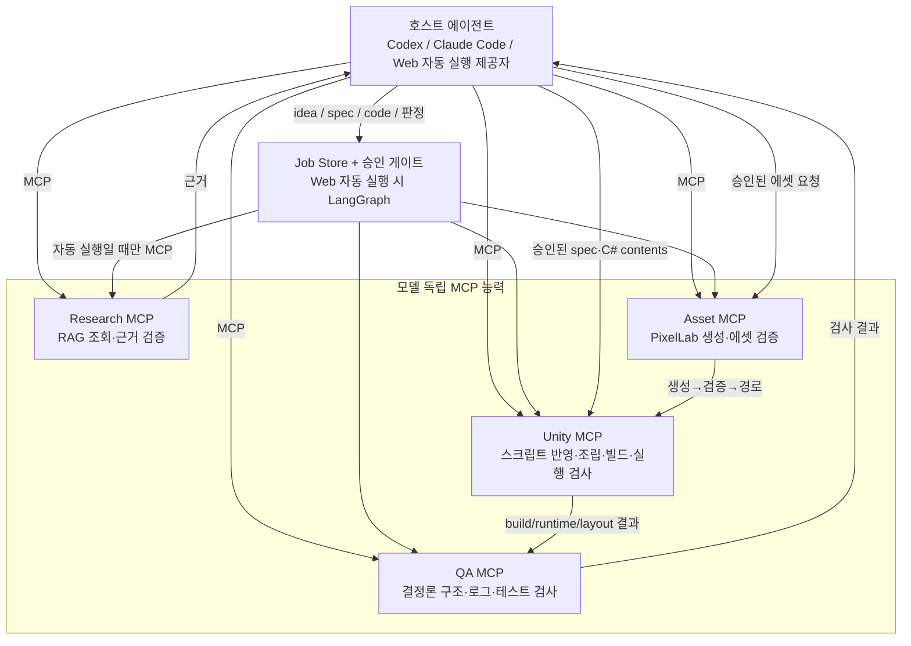

# Codex 범용 전환 검토서

작성일: 2026-08-11  
대상: `Src/DeveloperAI` LangGraph 오케스트레이터와 `Src/McpServers`

## 결론

현재 구현은 **MCP 전송 계층은 Codex와 호환**하지만, 자동 생성 경로는
Anthropic SDK와 Claude 모델명에 묶여 있다. 즉 "Claude Code도 쓸 수 있는 MCP
시스템"이지, 아직 "Codex와 Claude Code가 동등하게 쓸 수 있는 범용
오케스트레이션"은 아니다.

LangGraph는 유지해도 된다. 문제는 LangGraph가 아니라, MCP 서버가 모델 호출과
결정 책임까지 가져간 경계다. MCP는 외부 세계를 읽고 바꾸는 능력만 제공하고,
모델 추론·계획·코드 작성·판정은 Codex/Claude Code/Web 서비스라는 호스트가 맡아야 한다.

## 구현 현황 판정

| 영역 | 판정 | 근거 | 조치 |
|---|---|---|---|
| MCP 프로토콜 | 적합 | Streamable HTTP, stdio, `structuredContent`, 공식 Python SDK 사용 | 유지 |
| LangGraph 상태·재개 | 대체로 적합 | 승인 interrupt, 반복 상한, checkpoint 주입 경계가 명확 | Web 자동 실행에 한해 유지 |
| Unity/Asset 도구 | 적합 | Unity Editor·PixelLab이라는 외부 효과를 MCP로 격리 | 유지 |
| 오류·재시도 | 적합 | 멱등성별 재시도와 오류 코드 정규화 | 유지 |
| 모델 호출 | 부적합 | `strategic/planner.py`, `qa/judge.py`, `unity/codegen.py`, `unity/architecture.py`가 `AsyncAnthropic`과 `ANTHROPIC_API_KEY`에 직접 결합 | 분리 필수 |
| 클라이언트 설정 | 부적합 | 루트 `.mcp.json`이 `CLAUDE_PROJECT_DIR`만 전제 | 클라이언트 독립 실행 명령으로 전환 |
| Git MCP | 과잉 구성 | 호스트가 이미 Git 능력을 가지며 "최근 저장소" 폴백도 존재 | 기본 경로에서 제거 |

## 반드시 제거하거나 축소할 구성

### 1. MCP 서버 내부의 LLM 호출을 제거한다

다음은 MCP 능력이 아니라 모델 추론이다.

- `strategic/planner.py`: 기획 생성
- `qa/judge.py`: QA 판정 생성
- `unity/codegen.py`: C# 생성
- `unity/architecture.py`: 아키텍처 설계 생성

Codex가 이 도구를 불러도 Anthropic 키와 모델을 추가로 요구하므로, 실제 두뇌가
Claude로 고정된다. 다음처럼 축소한다.

| 기존 | 개정 |
|---|---|
| `generate_game_design` | 호스트가 작성한 `gameDesign`을 검증·정규화 |
| `generate_feature_prompt` | 결정론적 분해만 남기거나 호스트 책임으로 이동 |
| `design_architecture` | `design` 필수화; 스키마·경로·순환 참조만 검사 |
| `create_script` | `contents` 필수화; 경로 검증·기록·Unity 반영만 수행 |
| LLM 기반 QA | 규칙 기반 검사 결과만 반환하고 최종 판정은 호스트가 수행 |

Web의 무인 실행에 모델 호출이 꼭 필요하면 MCP 밖 `app/providers/`에 둔다.
두 번째 제공자가 실제로 생길 때만 제공자 인터페이스를 도입한다.

### 2. GitMcpServer를 기본 파이프라인에서 제거한다

**제거 요청:** `graph.py`의 기본 배포 의존성에서 `GitMcpServer`와 `Deployment`
노드를 뺀다. Codex/Claude Code는 이미 안전한 승인 흐름의 Git 능력을 제공하므로,
상태 없는 MCP 서버로 다시 감싼 것은 중복이다.

무인 배포가 필요한 경우에만 최소 Git 어댑터 또는 권한 격리형 Git MCP를 선택한다.
그 전까지는 모든 Git 도구의 `repoName`을 필수로 만들어야 한다. 현재의 "가장 최근
`git_init` 저장소" 폴백은 동시 작업에서 다른 저장소에 쓸 위험이 있다.

### 3. Claude 전용 실행 지침을 공통 문서로 옮긴다

`.claude/skills/`와 `CLAUDE.md`는 보조물로 유지할 수 있지만, 공통 계약과 유일한
실행 절차가 되어서는 안 된다. 공통 도구 계약과 검증 절차는 `README`/`Doc/설계`에
두고, `.mcp.json`은 Claude 예시로 명확히 표시한다. 어떤 공통 경로도
`CLAUDE_PROJECT_DIR` 같은 전용 환경변수를 요구하지 않는다.

## 첨부 구성도 평가와 수정안

첨부 구성도는 기획 → 기능별 spec → 스크립트 → Unity 조립 → 에셋이라는 큰 순서를
잘 잡았다. spec을 먼저 고정하는 흐름은 현재 `ConceptGate → Planning → ApprovalGate`와
맞는다. 다만 아래 상태로 구현하면 책임 충돌과 잘못된 검증 순서가 생긴다.

| 구성도 요소 | 판정 | 수정 |
|---|---|---|
| 기획 AI와 RAG 기획 | 조건부 유지 | RAG는 `Research MCP`의 조회 도구여야 한다. 독립 기획 AI가 최종 결정하면 Codex와 이중 두뇌가 된다. |
| Codex에서 개발 AI로 이어지는 연결 | 부적합 | Codex는 호출 대상이나 릴레이가 아니라 MCP를 직접 쓰는 호스트 에이전트로 맨 위에 둔다. |
| 개발 AI(코드 생성 MCP 호출) | 삭제 | 모델을 MCP 서버로 포장하지 않는다. 호스트가 코드를 만들고 Unity MCP는 `contents`를 검증·기록·반영한다. |
| 스크립트 생성 → 구조 검증 | 유지, 순서 보강 | 정적 검사 뒤 Unity 조립·컴파일·PlayMode 검사가 필수다. 구조 검사만으로 씬·프리팹 연결 실패를 찾지 못한다. |
| 파츠 검증(test) → 에셋 생성 | 순서 오류 | **에셋 생성 → 메타데이터/크기/투명도/라이선스 검사 → Unity import·bind**로 바꾼다. |
| 프로토타입 제작 | 불충분 | Build, compile, runtime, 구조 비교, 기능 QA, 사람 에스컬레이션의 종료 조건을 명시한다. |
| 사용자 피드백 | 유지, 명시화 필요 | Concept 승인과 기획 승인 두 게이트를 분리하고 각 재시도 상한을 둔다. |
| Job Store·이벤트 | 누락 | 중단 후 재개와 Web 진행 표시에 Postgres checkpoint/job history와 이벤트 스트림이 필요하다. |

### 반드시 삭제할 상자

**"개발 AI(코드 생성 MCP 호출)" 상자는 삭제하십시오.** 외부 효과를 가진 MCP
능력이 아니라 모델의 추론 역할이다. 유지하면 Codex가 다시 Claude 기반 코드 생성
MCP를 호출하는 우회 구조가 된다.

**기본 흐름에서 Git 배포 상자도 삭제하십시오.** 기능 QA 뒤 사용자가 승인할 때만
실행하는 선택 동작으로 두고, 호스트의 네이티브 Git을 우선 사용한다.

### 구현 가능한 목표 구성도

스크립트와 에셋 요청은 승인된 spec 뒤 병렬로 시작할 수 있다. 그러나 Unity
import/bind는 에셋 검증 뒤, 기능 QA는 Unity Build·PlayMode 검사 뒤에만 시작한다.
재시도는 호스트가 오류를 읽고 결정하며 상한을 넘으면 사람에게 넘긴다.

## LangGraph의 역할

| 모드 | 사용 주체 | 그래프 책임 |
|---|---|---|
| 에이전트 주도 | Codex 또는 Claude Code | 사용하지 않음. 호스트가 계획·판단하고 MCP 능력을 직접 호출 |
| 서비스 자동 실행 | Web API | 승인, 작업 상태, 재시도, 결정론 도구 호출. 모델 호출은 서비스 내부 제공자에 한정 |

`GraphState`에는 결과물과 검증 결과만 저장하고 제공자별 객체·세션·프롬프트 캐시는
넣지 않는다.

## 최소 전환 순서

1. `create_script(contents=...)`, `design_architecture(design=...)`의 키 없는 경로를 기본 계약으로 승격한다.
2. `StrategicMcpServer`를 `ResearchMcpServer`로 축소해 리서치 조회·스키마 lint·근거 검증만 남긴다.
3. QA 서버에서 규칙 기반 검사와 모델 판정을 분리한다.
4. 기본 LangGraph에서 Git 배포를 제거하고, 배포를 명시적 승인 뒤의 선택 단계로 만든다.
5. 공통 계약·런타임 코드에서 `ANTHROPIC_API_KEY`, `claude-*`, `.claude` 경로를 제거한다.
6. Codex·Claude Code 양쪽에서 동일한 `tools/list`, 입력 스키마, `structuredContent`, `isError`를 검증하는 통합 테스트를 추가한다.

## 검증 현황

구현을 정적으로 대조했다. 현재 워크스페이스에는 `Src/DeveloperAI/.venv`와 pytest가
없어 자동 테스트는 실행하지 못했다. 전환 구현 뒤에는 두 프로젝트 테스트와 실제
stdio·Streamable HTTP `tools/list` 검증을 모두 실행해야 한다.
