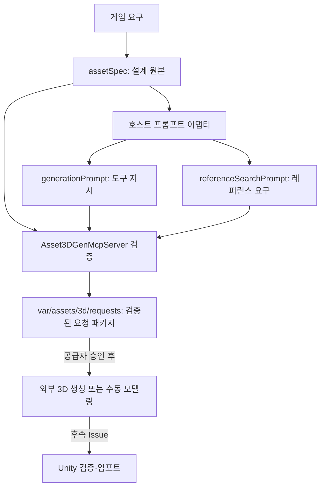

# 3D 에셋 요청 및 프롬프트 계약

## 현재 결정

| 현재 상태 | 문제 | 이 변경 |
|---|---|---|
| `asset.server`는 PixelLab 2D 전용 | 3D 요청이 2D 대체 이미지처럼 보일 수 있음 | 별도 `asset3d.server`가 3D 요청만 검증·보존 |
| 자유 텍스트 프롬프트 | 설계 의도와 도구 지시가 섞이고 이력이 사라짐 | 사양, 생성 프롬프트, 레퍼런스 검색 프롬프트를 한 요청 패키지에 저장 |
| 승인된 3D 공급자 없음 | 생성 결과를 신뢰할 수 없음 | `provider_unconfigured`을 명시하고 모델 경로나 2D 대체물을 반환하지 않음 |

이 문서는 Issue #2 범위의 계약이다. Unity 임포트, 프리팹, 리깅 실행, 실제 3D 공급자 선택은 이 계약 밖이다.

## 흐름



`assetSpec`이 원본이다. `generationPrompt`와 `referenceSearchPrompt`는 그 사양을 읽은 호스트가 특정 도구 또는 조사 작업에 맞춰 만든 파생물이다. 세 파일을 대화 내용 대신 요청 패키지에 함께 저장하므로 다른 에이전트도 그대로 재개할 수 있다.

## 입력 형식

`assetId`, `featureId`, `gameId`는 소문자 영문·숫자·`-`·`_`만 사용한다. 지원 `assetType`은 `character`, `slime`, `prop`, `environment`, `building`, `interactive`이고, 출력 형식은 `fbx`, `glb`, `gltf`이다.

```json
{
  "assetSpec": {
    "assetId": "slime-green",
    "assetType": "slime",
    "design": {
      "description": "둥근 초록 슬라임. 귀엽지만 약간 적대적이고, 스쿼시·스트레치가 읽히는 실루엣.",
      "style": "Slime Stigma Ranch의 귀여운 스타일라이즈드 3D"
    },
    "output": { "format": "glb", "maxTriangles": 2500 }
  },
  "generationPrompt": {
    "assetId": "slime-green",
    "method": "image_to_3d",
    "prompt": "Round green slime, neutral pose, clean silhouette, white background, no props."
  },
  "referenceSearchPrompt": {
    "assetId": "slime-green",
    "queries": ["cute stylized green slime turnaround", "simple slime squash stretch silhouette"],
    "requiredViews": ["front", "side", "back", "three-quarter"]
  }
}
```

`assetSpec.design`에는 게임이 필요한 모양과 스타일만 쓴다. 공급자별 문법, 카메라 문구, 네거티브 프롬프트는 `generationPrompt`에 둔다. `generationPrompt.method`는 `image_to_3d`, `text_to_3d`, `manual_blender`, `procedural`, `existing_asset` 중 하나다. 이미지 기반 방식은 레퍼런스에서 정면·측면·후면을 먼저 확보하고, 중립 자세·단순 배경·일관된 조명을 요구한다.

## MCP 사용과 산출물

호스트는 사양과 두 파생 프롬프트를 작성한 뒤 다음 도구를 호출한다.

```text
asset3d.server / validate_3d_asset_prompts
asset3d.server / prepare_3d_asset_request
```

로컬에서 직접 실행할 때는 `.venv\\Scripts\\python.exe -m asset3d.server`를 사용한다.

`prepare_3d_asset_request`는 `var/assets/3d/requests/<gameId>/<assetId>__<사양해시>.json`을 만들고 사양·두 프롬프트·SHA-256 출처·상태를 보존한다. 상태는 현재 반드시 `provider_unconfigured`이다. 따라서 `assetPath`는 반환되지 않으며, 2D PixelLab 결과를 최종 3D 모델로 오인할 수 없다.

요청을 수정하면 새 사양 해시로 별도 패키지가 생긴다. 검토자는 이전 패키지를 비교하고, 다음 에이전트는 선택한 패키지를 공급자 작업의 입력으로 사용한다. 슬라임의 색상·희귀도·스티그마 차이는 후속 Unity/게임플레이 작업에서 기본 메시와 공유 머티리얼·데이터 변형으로 우선 표현한다. 별도 모델은 실루엣이나 리그가 실제로 달라질 때만 요청한다.

## 경계와 다음 단계

이 서버는 모델 호출을 하지 않는다. 승인된 공급자가 생기면 이 서버 안에만 공급자 접근 코드를 추가하고, 공급자 오류는 명시적으로 반환해야 한다. 그 다음에만 생성된 `glb`/`fbx`의 메시·텍스처·리그 검증과 Unity 임포트 계약을 별도 Issue로 추가한다.
