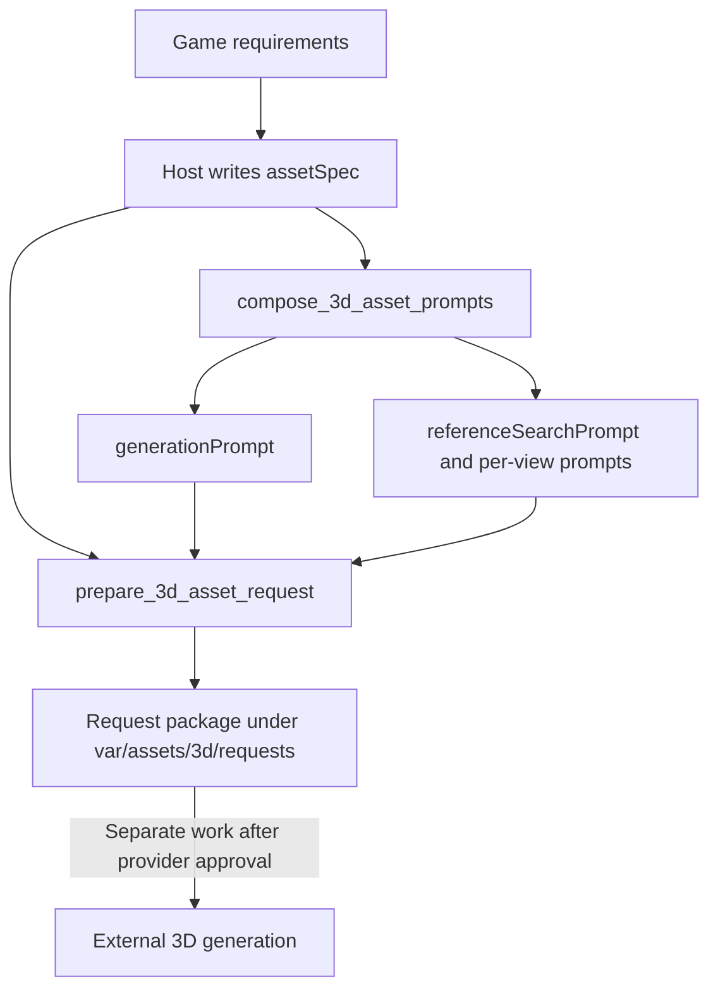

# 3D Asset Specification and Prompt Contract

## Responsibilities and Flow

The host agent writes an `assetSpec` that captures the game's intent. Without making
model-driven decisions, `Asset3DGenMcpServer` applies the specification to deterministic
templates, composes and validates provider-neutral prompts, and preserves the request
package. External 3D providers and Unity integration are outside this contract.



## Specification

Every asset uses the following fields. `animation.rigType` and `animation.clips` are
required only when `animation.required` is `true`. The optional lists `materials`,
`preserve`, and `exclude` may be omitted.

| Area | Fields |
|---|---|
| Identity | `assetId`, `assetName`, `assetType`, `gameplayRole` |
| Design | `description`, `style`, `proportions`, `colors`, required `form`, optional `materials`, `preserve`, `exclude` |
| Geometry | `maxTriangles`, `separateMeshes`, required `shading` |
| Output | `format`, `scale`, `pivot`, `pivotPolicy`, `collider` |
| Texture | `required`, `description`, `maps`, optional `surfaceDetails`, optional `material` |
| Animation | `required`, conditional `rigType`, `clips` |
| Generation | `method` |
| Validation | `requirements` |

Supported `assetType` values are `character`, `slime`, `monster`, `prop`,
`environment`, `building`, and `interactive`. Supported `method` values are
`image_to_3d`, `text_to_3d`, `manual_blender`, `procedural`, and `existing_asset`.

`design.form` prevents a recognizable silhouette from hiding an unusable object. It requires
`silhouette`, `primaryVolumes`, `partRelationships`, `surfaceFeatures`, and `bevelPolicy`.
Describe connected parts, intentional inset/extrude depth, and only the edges that justify bevel
budget. Do not approximate an inset frame by attaching four unrelated bars.

`output.pivotPolicy` is one of `ground_center`, `center`, `root`, or `custom`. Ordinary static
props normally use `ground_center`: the lowest support point is on the ground plane and the
horizontal center is the origin. Organic, animated, hanging, or gameplay-specific assets may use
another explicit policy. Export and format conversion must preserve the selected origin.

`geometry.shading` requires `normalPolicy`, outward `faceOrientation`, and non-empty
`smoothingRules`. Hard-surface props normally use `explicit_hard`; organic surfaces use
`explicit_smooth` or `mixed`. Exported meshes must carry explicit normals, keep all renderable
faces outward, and split normals across intended hard edges so triangulation cannot create
diagonal lighting gradients or expose flipped faces.
`geometry.integrity` requires all four safeguards to be true: reject degenerate faces,
duplicate faces, and coplanar overlaps, while preserving hard-edge vertex/normal splits across
triangulation and format conversion. Parts may touch intentionally, but they must not intersect
or leave thin sliver faces at joints.
Supported output formats are `fbx`, `glb`, and `gltf`.

Treat `geometry.maxTriangles` as a final runtime ceiling, not a detail target. Planning should
normally budget 100-500 triangles for distant background props, 500-1,500 for ordinary props,
and more only for close-up or silhouette-complex assets. Reference prompts model only silhouette
and primary volumes; repeated or tiny details that do not change the silhouette must be shown as
flat color or normal-map information so Image-to-3D does not spend geometry on them.

`texture.material` contains `baseColor` (`#RRGGBB`), `metallic`, and `roughness`
(both from 0 to 1). The server selects `material_only` only when `design.colors`
and `design.materials` each declare at most one appearance region and
`texture.surfaceDetails` is empty. Multiple colors or materials select
`generated_texture`; flattening a screen, keyboard, body, or other distinct region
into one material is not an optimization. Required decals, patterns, wear, or other
unique appearance also belong in `surfaceDetails` and select `generated_texture`.
Omitting `material` preserves the generated-texture behavior.

Multiple Unity material slots are not a safe automatic substitute when the provider returns
one mesh without semantic face or part IDs: assigning screen, keys, trim, or body by position
would be object-specific and can silently damage unrelated assets. Prefer a compact generated
texture in that case. A texture-free multi-material palette is valid only when the generated
model carries stable, specification-matched part or material IDs; each extra material slot also
adds a render submission, so it must be chosen for measured runtime value rather than appearance
flattening.

Asset-type differences are expressed through specification values.

| Type | Main requirements |
|---|---|
| Character | Animation, rig, clips, neutral pose, and three-view references |
| Slime or monster | Deformation-ready neutral pose and any required rig and clips |
| Prop, environment, or building | `animation.required: false` when static; references depend on the generation method |
| Interactive object | Use `separateMeshes` and animation requirements for moving and fixed parts |

## Deterministic Prompt Composition

`generationPrompt.prompt` is composed in this order:

1. Asset name, type, and gameplay role
2. Description and silhouette
3. Style and proportions
4. Colors and materials
5. Neutral pose and deformation requirements when needed
6. Triangle budget and output format
7. Separate meshes, scale, pivot, and collider
8. Rig and animation clips when needed
9. Preserve and exclude requirements

An `image_to_3d` method or `character` asset requires front, side, and back references.
Every view prompt shares the same description, style, proportions, and colors and includes
a neutral pose, unobstructed parts, a plain background, consistent lighting, and minimal
perspective distortion. Other methods do not force unnecessary references.

`validate_3d_asset_prompts` compares the supplied prompts with prompts recomposed from the
same specification. Reusing stale prompts after changing the specification or editing only
a prompt is therefore rejected with error code `1000`.

## Complete Slime Example

```json
{
  "assetId": "slime-green",
  "assetName": "Green Slime",
  "assetType": "slime",
  "gameplayRole": "a readable ranch encounter",
  "design": {
    "description": "A rounded slime with a clear silhouette",
    "style": "cute stylized 3D",
    "proportions": "compact and broad",
    "colors": ["leaf green", "cream"],
    "form": {
      "silhouette": "compact rounded outline",
      "primaryVolumes": ["one rounded body"],
      "partRelationships": ["eyes attached to the front surface"],
      "surfaceFeatures": ["preserve intentional recesses and protrusions"],
      "bevelPolicy": ["bevel only silhouette-defining hard edges"]
    },
    "materials": ["soft matte body"],
    "preserve": ["round silhouette"],
    "exclude": ["text", "weapons"]
  },
  "geometry": {
    "maxTriangles": 2500,
    "separateMeshes": [],
    "shading": {
      "normalPolicy": "mixed",
      "faceOrientation": "outward",
      "smoothingRules": ["split normals across silhouette-defining hard edges"]
    },
    "integrity": {
      "forbidDegenerateFaces": true,
      "forbidDuplicateFaces": true,
      "forbidCoplanarOverlaps": true,
      "preserveHardEdgeSplits": true
    }
  },
  "output": {
    "format": "glb",
    "scale": 1.0,
    "pivot": "ground center",
    "pivotPolicy": "ground_center",
    "collider": "single capsule"
  },
  "texture": {
    "required": true,
    "description": "matte stylized surface with readable color separation",
    "maps": ["base color"]
  },
  "animation": {
    "required": true,
    "rigType": "simple deform rig",
    "clips": ["idle", "move"]
  },
  "generation": {
    "method": "image_to_3d"
  },
  "validation": {
    "requirements": [
      "silhouette matches the specification",
      "triangle budget passes"
    ]
  }
}
```

Calling `compose_3d_asset_prompts` with this specification produces:

- `generationPrompt`: all generation requirements and `sourceSpecSha256`
- `referenceSearchPrompt.queries`: turnaround and proportion/material search queries
- `referenceSearchPrompt.requiredViews`: `front`, `side`, and `back`
- `referenceSearchPrompt.viewPrompts`: consistent image-generation instructions per view

Do not maintain copied prompts manually. Recompose them after changing the specification
to produce prompts and a request package with a new SHA-256 digest.

## MCP Usage

```text
1. compose_3d_asset_prompts(assetSpec)
2. Optionally validate_3d_asset_prompts(assetSpec, generationPrompt, referenceSearchPrompt)
3. prepare_3d_asset_request(featureId, assetSpec, gameId)
```

`prepare_3d_asset_request` recomposes and validates the prompts before saving them to:

```text
var/assets/3d/requests/<gameId>/<assetId>__<spec-hash>.json
```

The package preserves the original specification, both derived prompts, their SHA-256
digests, game and feature IDs, and the creation timestamp. Because no provider is approved,
the status is `provider_unconfigured`, and neither an `assetPath` nor a 2D placeholder is
returned.

Run locally:

```powershell
.venv\Scripts\python.exe -m asset3d.server
```
