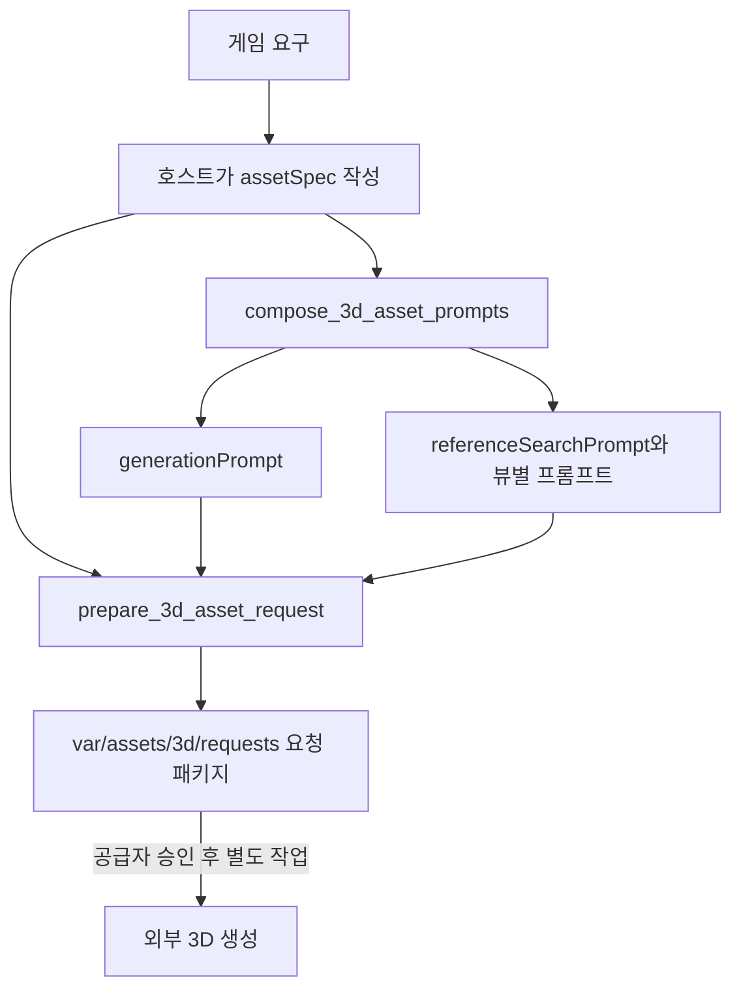

# 3D 에셋 사양 및 프롬프트 계약

## 책임과 흐름

호스트 에이전트는 게임 의도가 담긴 `assetSpec`을 작성한다. `Asset3DGenMcpServer`는
모델 판단 없이 사양을 결정적 템플릿에 대입해 공급자 중립 프롬프트를 조립·검증하고
요청 패키지를 보존한다. 외부 3D 공급자와 Unity 연동은 이 계약의 범위 밖이다.



## 사양

모든 에셋은 다음 필드를 사용한다. `animation.rigType`과 `animation.clips`만
`animation.required`가 `true`일 때 필수다. 선택 목록인 `materials`, `preserve`,
`exclude`는 생략할 수 있다.

| 영역 | 필드 |
|---|---|
| 식별 | `assetId`, `assetName`, `assetType`, `gameplayRole` |
| 디자인 | `description`, `style`, `proportions`, `colors`, 선택적 `materials`, `preserve`, `exclude` |
| 지오메트리 | `maxTriangles`, `separateMeshes` |
| 출력 | `format`, `scale`, `pivot`, `collider` |
| 애니메이션 | `required`, 조건부 `rigType`, `clips` |
| 생성 | `method` |
| 검증 | `requirements` |

지원 `assetType`은 `character`, `slime`, `monster`, `prop`, `environment`,
`building`, `interactive`이다. 지원 `method`는 `image_to_3d`, `text_to_3d`,
`manual_blender`, `procedural`, `existing_asset`이며 출력은 `fbx`, `glb`, `gltf`이다.

종류별 차이는 사양 값으로 표현한다.

| 종류 | 주요 사양 |
|---|---|
| 캐릭터 | 애니메이션, 리그, 클립, 중립 자세와 3면 레퍼런스 |
| 슬라임·몬스터 | 변형 가능한 중립 자세, 필요한 리그와 클립 |
| 소품·환경·건물 | 정적이면 `animation.required: false`; 레퍼런스는 생성 방식에 따라 선택 |
| 상호작용 오브젝트 | 움직이는 부분이 있으면 `separateMeshes`와 애니메이션 조건으로 표현 |

## 결정적 프롬프트 조립

`generationPrompt.prompt`는 다음 순서로 조립된다.

1. 에셋 이름·종류·게임플레이 역할
2. 설명과 실루엣
3. 스타일과 비율
4. 색상과 재질
5. 필요한 경우 중립 자세와 변형 조건
6. 삼각형 수와 출력 형식
7. 분리 메시, 스케일, 피벗, 콜라이더
8. 필요한 경우 리그와 애니메이션 클립
9. 보존 및 제외 조건

`image_to_3d` 또는 `character`는 정면·측면·후면 레퍼런스를 요구한다. 각 뷰의
프롬프트는 동일한 설명·스타일·비율·색상을 공유하며 중립 자세, 가림 없는 구성,
단순 배경, 일관된 조명, 최소 원근 왜곡을 포함한다. 그 외 방식은 불필요한
레퍼런스를 강제하지 않는다.

`validate_3d_asset_prompts`는 전달된 프롬프트를 같은 사양에서 다시 조립한 결과와
비교한다. 따라서 사양이 바뀐 뒤 예전 프롬프트를 재사용하거나 프롬프트만 임의로
수정하면 오류 코드 `1000`으로 거부된다.

## Slime 전체 예시

```json
{
  "assetId": "slime-green",
  "assetName": "Green Slime",
  "assetType": "slime",
  "gameplayRole": "a readable ranch encounter",
  "design": {
    "description": "A rounded slime with a clear silhouette",
    "style": "cute stylized 3D",
    "proportions": "compact and broad",
    "colors": ["leaf green", "cream"],
    "materials": ["soft matte body"],
    "preserve": ["round silhouette"],
    "exclude": ["text", "weapons"]
  },
  "geometry": {
    "maxTriangles": 2500,
    "separateMeshes": []
  },
  "output": {
    "format": "glb",
    "scale": 1.0,
    "pivot": "ground center",
    "collider": "single capsule"
  },
  "animation": {
    "required": true,
    "rigType": "simple deform rig",
    "clips": ["idle", "move"]
  },
  "generation": {
    "method": "image_to_3d"
  },
  "validation": {
    "requirements": [
      "silhouette matches the specification",
      "triangle budget passes"
    ]
  }
}
```

이 사양으로 `compose_3d_asset_prompts`를 호출하면 다음 산출물이 생긴다.

- `generationPrompt`: 사양의 모든 생성 조건과 `sourceSpecSha256`
- `referenceSearchPrompt.queries`: 스타일 턴어라운드와 비율·재질 검색어
- `referenceSearchPrompt.requiredViews`: `front`, `side`, `back`
- `referenceSearchPrompt.viewPrompts`: 세 뷰 각각의 일관된 이미지 생성 지시

프롬프트를 직접 복사해 관리하지 않는다. 사양을 수정한 뒤 다시 조립하면 새
SHA-256이 들어간 프롬프트와 요청 패키지가 만들어진다.

## MCP 사용

```text
1. compose_3d_asset_prompts(assetSpec)
2. 필요하면 validate_3d_asset_prompts(assetSpec, generationPrompt, referenceSearchPrompt)
3. prepare_3d_asset_request(featureId, assetSpec, gameId)
```

`prepare_3d_asset_request`는 내부에서 다시 조립·검증한 뒤 다음 위치에 저장한다.

```text
var/assets/3d/requests/<gameId>/<assetId>__<spec-hash>.json
```

패키지는 원본 사양, 두 파생 프롬프트, 각 SHA-256, 게임·기능 ID와 생성 시각을
보존한다. 승인된 공급자가 없으므로 상태는 `provider_unconfigured`이며 `assetPath`나
2D 대체물을 반환하지 않는다.

로컬 직접 실행:

```powershell
.venv\Scripts\python.exe -m asset3d.server
```
