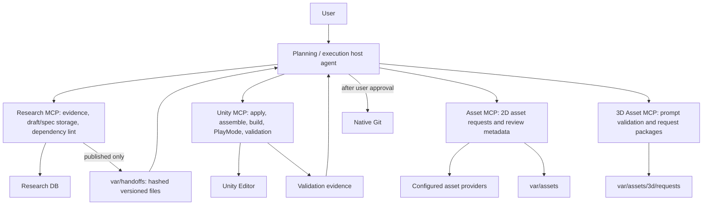

# Architecture

## Decision

Agent-first is the default. Codex or Claude Code is the sole reasoning layer. There is no
Web, FastAPI, or LangGraph orchestrator.

## Ownership

### Host agent

- Interpret requests; plan; draft blueprints, specs, architecture, and code.
- Judge validation evidence and control bounded retries.
- Obtain user approval and perform native Git operations.

### Research MCP

- Retrieve source cards, supporting evidence, and counterexamples.
- Store concept decisions, game-level blueprints, and feature-level specs.
- Validate spec schema, citations, and role boundaries.

### Unity MCP

- Validate completed architecture and C#.
- Apply files; assemble scenes, prefabs, and references.
- Return raw compile, build, PlayMode, and layout evidence.

### Asset MCP

- Call configured asset providers and return usage metadata.
- Validate file metadata, measure deterministic raster defects, and record human review metadata.
- Store output under `var/assets` and record human review metadata.

### 3D Asset MCP

- Deterministically compose and validate provider-neutral 3D prompts from host-authored specifications.
- Store request packages under `var/assets/3d/requests`; no 3D provider or model generation is configured.

## Deliberately absent

- LLM calls inside MCP servers
- Git MCP or automatic deployment nodes
- Web dashboard, REST/SSE API, job database, Redis event bus
- Committed generated images, blueprints, or experiment output
- Provider/factory/interface layers with one implementation

## Ordering and exit

Drafts are directly editable. Only a fully published, acyclic specification graph may be exported
as a hand-off package. After export, code and asset requests may be prepared in parallel. Asset
generation follows a bounded host-agent loop: complete the brief, generate one MCP prototype,
inspect technical evidence, obtain semantic and human review, then generate API variations from
one to four approved style anchors. Import and bind assets only after validation. Make the final
feature judgment only after build, compile, PlayMode, and layout evidence is available. Retry the
same failure at most three times, then ask the user.

## Source of truth and write order

- A blueprint stores game-level decisions and an ordered `specIds` list only.
- A feature spec stores the complete task document exactly once.
- Validation completes before storage. Since the Neon HTTP fallback has no transaction support,
  spec rows are written before the blueprint that makes them visible to a hand-off.
- Each accepted spec revision also creates a new blueprint version, so a new immutable hand-off
  version is available instead of overwriting a prior execution input.
