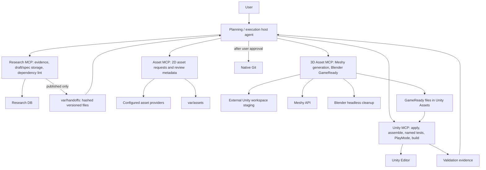
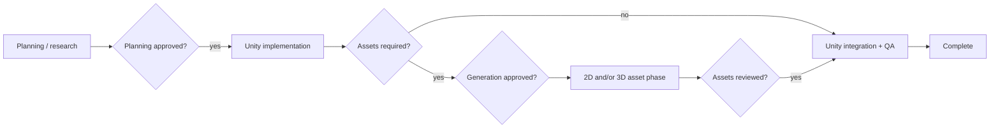

# Architecture

## Decision

Agent-first is the default. Codex or Claude Code is the sole reasoning layer. There is no
Web, FastAPI, or LangGraph orchestrator.

For multi-phase local execution, a small Python Phase Controller is the deterministic control
plane. It is not an agent and makes no design decisions. Each runnable phase starts a fresh
non-interactive Codex thread with exactly one role's MCP profile, accepts a JSON-Schema-bounded
result, closes that process, and persists state beneath `var/runs/` before proceeding.

The controller uses `codex exec`, not the TypeScript Codex SDK. The CLI already supports fresh
non-interactive threads, JSONL lifecycle events, JSON Schema output, and a final-result file while
preserving this repository's Python-only runtime. The SDK would add Node.js solely for thread
lifecycle APIs that this workflow deliberately does not use across phases. Agents SDK orchestration,
Desktop UI automation, GitHub Actions, and general workflow engines were rejected here: they either
add a second reasoning/control layer, cannot enforce these local human gates, or do not fit a local
Unity Editor boundary. See the official [Codex non-interactive mode](https://developers.openai.com/codex/noninteractive)
and [Codex SDK](https://developers.openai.com/codex/sdk) documentation.

## Ownership

### Host agent

- Interpret requests; plan; draft blueprints, specs, architecture, and code.
- Judge validation evidence and control bounded retries.
- Obtain user approval and perform native Git operations.

### Research MCP

- Retrieve source cards, supporting evidence, and counterexamples.
- Store concept decisions, game-level blueprints, and feature-level specs.
- Validate spec schema, citations, and role boundaries.

### Unity MCP

- Validate completed architecture and C#.
- Apply files; assemble scenes, prefabs, and references.
- Return raw compile, named-test, PlayMode console, build, and layout evidence.

### Asset MCP

- Call configured asset providers and return usage metadata.
- Validate file metadata, measure deterministic raster defects, and record human review metadata.
- Store output under `var/assets` and record human review metadata.

### 3D Asset MCP

- Deterministically compose and validate provider-neutral 3D prompts from host-authored specifications.
- Submit validated single- or multi-image Image-to-3D work to Meshy from human-approved references.
  Reject Text-to-3D and store reference/provider provenance in external staging.
- Run Blender headless cleanup and GameReady quality gates. Keep 3D runtime state in an absolute staging directory in
  the external Unity workspace and copy only passing FBX or GLB output into Unity `Assets/`.
- Hand a validated model path to Unity MCP for import, model-backed prefab creation, and scene composition.

## Deliberately absent

- LLM calls inside MCP servers
- Git MCP or automatic deployment nodes
- Web dashboard, REST/SSE API, job database, Redis event bus
- Committed generated images, blueprints, or experiment output
- Provider/factory/interface layers with one implementation

## Ordering and exit

Drafts are directly editable. Only a fully published, acyclic specification graph may be exported
as a hand-off package. After export, code and asset requests may be prepared in parallel. Asset
generation follows a bounded host-agent loop: complete the brief, generate one MCP prototype,
inspect technical evidence, obtain semantic and human review, then generate API variations from
one to four approved style anchors. Import and bind assets only after validation. For each Unity
feature, apply [the functional QA policy](unity-functional-qa.md): compile, focal named tests,
PlayMode console smoke, regression tests, and layout checks precede the final build. Make the final
feature judgment only after all required evidence is available. Retry the same failure at most
three times, then ask the user.

## Source of truth and write order

- A blueprint stores game-level decisions and an ordered `specIds` list only.
- A feature spec stores the complete task document exactly once.
- Validation completes before storage. Since the Neon HTTP fallback has no transaction support,
  spec rows are written before the blueprint that makes them visible to a hand-off.
- Each accepted spec revision also creates a new blueprint version, so a new immutable hand-off
  version is available instead of overwriting a prior execution input.
