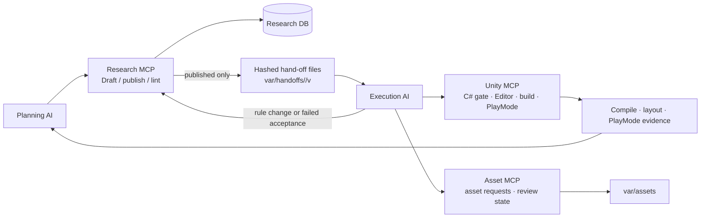
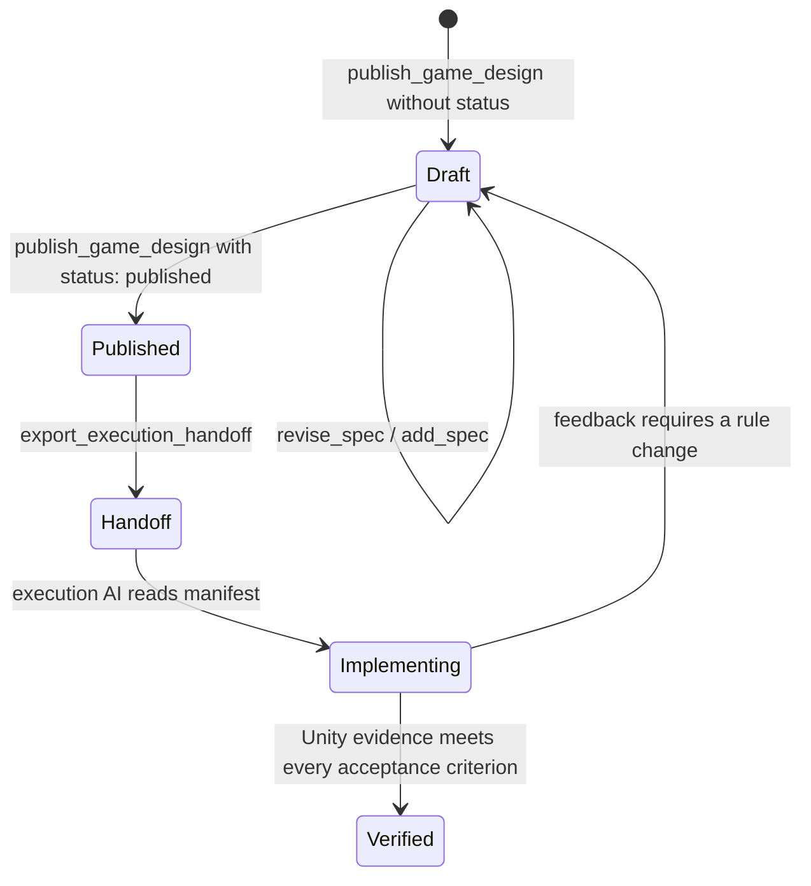
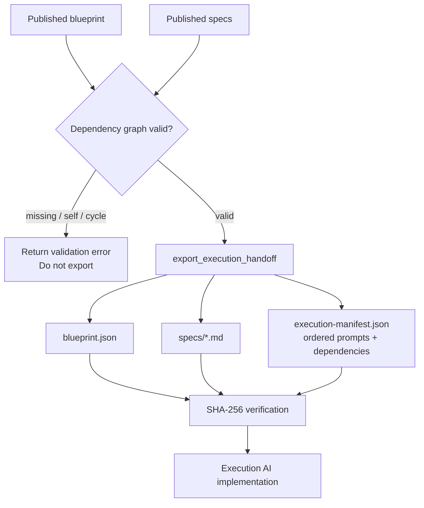

# Guide boards

This document is the operational contract for planning, asset, implementation,
and QA agents. It is current for this repository as of 2026-08-12. Facts about
Unity 6 editor APIs used by the provided template were checked against Unity's
current official documentation on this date.

## Priority order

| Priority | Confirmed issue | Applied control |
|---|---|---|
| P0 | A valid-looking plan could contain a missing or cyclic feature dependency. | Reject the graph before it can be exported to execution. |
| P0 | A tracked local MCP configuration contained another checkout's absolute user path, and bootstrap preserved it without a clear repair path. | The tracked file is removed; bootstrap creates ignored local configuration and offers a backup-first repair command. |
| P1 | Planning storage had no immutable file boundary for a separate execution AI. | Published designs export a hashed, versioned hand-off package. |
| P1 | `publish_game_design` published on the first call, preventing an editable design stage. | Designs now default to `draft`; execution prompts are withheld until explicit `published` state. |
| P2 | There was no maintained structure map or asset feedback procedure. | This guide supplies both, tied to the actual MCP ownership boundaries. |
| P2 | Unity automation requires a locally configured project and an active Editor relay. | A complete Unity 6 editor-tool template is supplied for the execution hand-off; verify the bridge before installing or compiling it. |

## Current hand-off state

- Implemented: Research, Unity, and Asset MCP boundaries; draft/published design states; dependency validation; immutable planning-file export; asset review metadata.
- Source configuration: `.mcp.json` and `.codex/config.toml` are intentionally not versioned. Run bootstrap to create local configurations for the current checkout.
- Local runtime integrations (Unity project and relay, Research DSN, and PixelLab key) are intentionally not recorded in versioned documentation. Check their availability through the MCP status tools before use.
- Verified locally: Python unit tests, Python bytecode compilation, and MCP contract schemas.
- Not verified locally: Unity C# template compilation, Editor bridge calls, build, PlayMode, scene/prefab integrity, live Research DB, and live PixelLab calls.

## System board: implemented structure



The only reasoning agents are the planning and execution agents. MCP servers
validate, store, or perform an external effect; they do not select game rules
or call a model.

## Design-state board



Use this minimal, directly editable design envelope. `status` is intentionally
omitted for a draft. Add `"status": "published"` only after the planning
review approves the complete dependency graph.

```json
{
  "title": "Example game",
  "genre": "platformer",
  "visualDimension": "3D",
  "coreMechanics": ["run", "jump", "collect"],
  "artStyle": "project-defined visual style",
  "structureOverview": "Describe the playable structure and independently testable features.",
  "specs": []
}
```

## Planning-to-execution hand-off board



`export_execution_handoff(gameId)` writes `var/handoffs/<gameId>/v<blueprintVersion>/`.
It never overwrites an existing version. The execution AI must first verify every
digest listed in `execution-manifest.json`, then implement feature prompts only
after their listed dependencies. The package contains no environment variables,
API keys, database DSNs, or user-specific paths.

## Lightweight task specification

`SpecDocument` is the source of truth for task fields. It remains small, while
the exported feature prompt contains these execution-ready keys:

| Field | Owner | Purpose |
|---|---|---|
| `feature_id`, `title`, `objective`, `context` | Planning | Identify the task and its reason. |
| `relevantSystems`, `dependencies` | Planning | State feature-level relationships without choosing C# types. |
| `implementationRequirements`, `constraints` | Planning | Define behavior and boundaries. |
| `acceptanceCriteria`, `verificationMethod` | Planning + QA | Define observable completion and its evidence. |
| `assets_needed` | Planning | Declare the assets associated with this feature. |
| `asset_specs` | Planning | Carry complete 3D specifications directly to the 3D Asset MCP. |
| file/type/scene mapping | Execution | Produced by `design_architecture`; this prevents planning from dictating implementation details. |

`status` remains on the stored spec. A draft can be edited directly; a published
spec is included in an immutable hand-off only after its complete dependency graph validates.

Before using the package, run `verify_handoff(packagePath)`. It verifies the
external `execution-manifest.sha256` checksum before checking every input file
listed by the manifest.

## Agent migration boards

### Planning AI

1. Retrieve evidence and counterexamples through Research MCP.
2. Write a complete game blueprint as `draft`; retain the editable source in the planning store.
3. Create feature specs with observable acceptance criteria and feature-level dependencies.
4. Resolve all dependency errors before changing the blueprint to `published`.
5. Export the hand-off package. Do not send an execution agent a partial draft.

### Asset AI

1. Read `blueprint.visualDimension` and the asset declarations from the execution manifest.
2. For each `asset_specs` entry, pass the unchanged object and feature ID to the 3D Asset MCP. Generate the reference image first when its method is `image_to_3d`.
3. Select PixelLab only for declared 2D work; never route a 3D failure to a 2D placeholder.
4. Preserve generated provenance and return structured feedback for rejected output.

### Unity execution AI

1. Verify the hand-off manifest digests and inspect the dependency graph before writing files.
2. Call `design_architecture` before creating C# or Unity objects.
3. Use Unity MCP to create scripts, import approved assets, assemble references, then collect compile, build, PlayMode, and layout evidence.
4. Treat a feature as incomplete until its acceptance criteria have matching evidence.
5. Return rule changes to Planning AI; do not alter the feature's intended behavior locally.

### QA AI

1. Check every acceptance criterion against raw Unity evidence, not an agent summary.
2. Check that the scene/prefab layout contains the expected bindings.
3. Record failed criteria as feedback against the feature version and require a spec revision where the game rule changes.

## Asset prompt and feedback board

Choose the fields that make the requested asset unambiguous. Do not place
credentials, personal data, or local absolute paths in prompts or feedback.

```text
Asset type and dimension: [2D illustration / UI / texture / 3D model / audio / other]
Gameplay role: [player / enemy / terrain / UI / other]
Subject and visual requirements: [project-specific description]
Technical requirements: [size, format, rigging, animation, material, or other applicable constraints]
Exclude: [unwanted content]
```

Use this feedback payload after human review:

```json
{
  "assetId": "<asset id>",
  "approved": false,
  "note": "State the observable correction required before approval."
}
```

The note must identify an observable correction. Asset review is human metadata,
not a model decision.

## Unity sprite-animation tool

The complete Unity 6 editor template is at
[`templates/unity-editor/SpriteAnimationCreatorWindow.cs`](../templates/unity-editor/SpriteAnimationCreatorWindow.cs).
The execution AI copies it to `Assets/Editor/` in the target Unity project. It
validates the texture path and grid, slices a multiple-sprite sheet through the
current `UnityEditor.U2D.Sprites` data-provider API, and creates a `SpriteRenderer`
animation clip with an object-reference curve. Unity documents this provider API
for custom editor tools and requires a reimport after applying sprite data; Unity
6 documents `AnimationUtility.SetObjectReferenceCurves` for creating the sprite
reference curve. See [Sprite Editor Data Provider API](https://docs.unity3d.com/6000.0/Manual/sprite/sprite-editor/sprite-editor-data-provider-api.html) and [SetObjectReferenceCurves](https://docs.unity3d.com/ScriptReference/AnimationUtility.SetObjectReferenceCurves.html).

The template is not installed in this repository and must be compiled only after
an execution agent copies it into the target Unity project's `Assets/Editor/`
directory. Treat compilation and an import test as Unity-side evidence, not as
evidence supplied by this template alone.

## Unity test reporter

[`templates/unity-editor/PipelineTestReporter.cs`](../templates/unity-editor/PipelineTestReporter.cs)
and its `.asmdef` are copied into `Assets/Editor/` alongside the other templates. The MCP
tool `run_named_tests` starts a filtered run through `TestRunnerApi`; this reporter records
each finished test into `EditorPrefs`, and the tool polls those keys.

Two constraints force that shape. A test run crosses a domain reload, so callbacks
registered by an injected command die before the run ends; an `[InitializeOnLoad]` class in
the project re-registers after every reload. And the MCP command runner refuses source that
merely mentions `File.WriteAllText`, so `EditorPrefs` carries the hand-off instead of a
results file.

Without the reporter installed, `run_named_tests` reports the reporter as absent rather than
guessing. Results are written after every finished test, so a run that stalls still leaves
behind what it managed to prove.

## Unity animation debugging tool

[`templates/unity-editor/AnimationDebugWindow.cs`](../templates/unity-editor/AnimationDebugWindow.cs)
is the human-facing companion to the animation MCP tools, opened from
**Tools > Game Development > Animation Debugger** after the same copy into
`Assets/Editor/`. It does three things the MCP tools cannot do for a person:

1. Build a clip from a folder of loose frame PNGs, in file-name order — the order
   `generate_2d_animation` zero-pads its frames for.
2. List every `AnimatorController` with its states, parameters, and per-clip frame
   counts, and flag prefabs and scene objects whose `Animator` has no controller.
3. Drive a live `Animator`'s parameters during PlayMode and read back the current
   state, so a transition that never fires can be seen rather than guessed.

The second and third points exist because a missing controller fails silently:
`SetFloat` and `SetTrigger` do nothing, no error is logged, and PlayMode
verification still passes. `inspect_animator` reports the same facts to the host
agent, and layout rule `L8` reports them in `inspect_project_layout`.

## First vertical slice and improvement evidence

The first implementation must be a browser-playable vertical slice, not a
foundation-only milestone. Keep it to one core player action, one explicit
failure condition, and observable feedback. Its acceptance criteria must include
a successful `WebGL` build and a browser launch check. `WebGL` is the default
build target; `StandaloneWindows64` remains an explicitly supported local
alternative.

For each completed slice, the host writes one lightweight evidence record under
`var/metrics/<gameId>/<sliceId>.json`. It is disposable runtime output, never a
planning source of truth or committed artifact.

```json
{
  "sliceId": "slice-001",
  "firstPlayableMinutes": 0,
  "agentCalls": 0,
  "humanInterventions": ["approval required before asset import"],
  "researchEvidence": {"retrieved": 0, "used": 0},
  "validation": {"buildFailures": [], "playModeFailures": []}
}
```

Use actual counts and failure messages only. A missing measure stays absent or
is recorded as `null`; it must never be estimated. These records show whether a
future improvement belongs in the prompt, an MCP boundary, Unity automation, or
a human review step without adding a new server or database.
